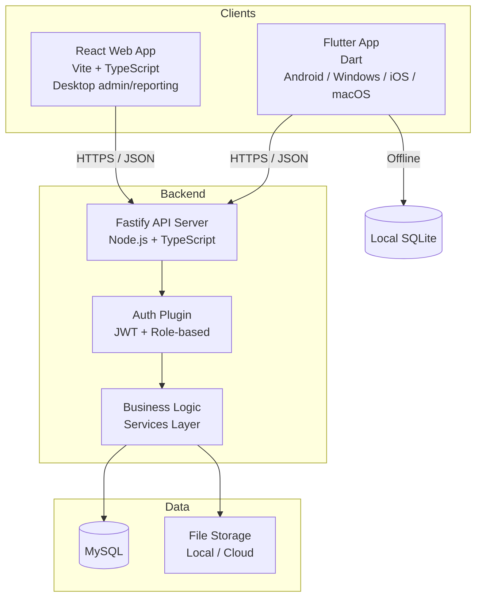
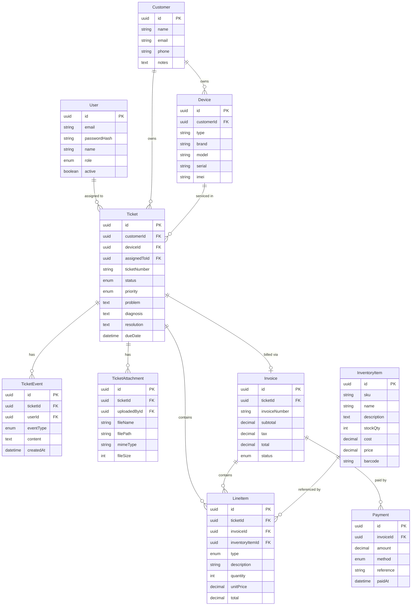

# Architecture Overview

## System Components



## Backend Architecture

Layered architecture with clear separation of concerns:

```
backend/src/
├── index.ts              — Server entry point
├── config/               — Environment and app configuration
├── plugins/              — Fastify plugins (auth, cors, rate-limit, etc.)
├── routes/               — Route definitions with JSON Schema validation
├── services/             — Business logic (pure domain operations)
├── db/
│   ├── schema/           — Drizzle table definitions
│   ├── migrations/       — SQL migration files
│   └── index.ts          — Database connection
├── utils/                — Shared helpers
└── types/                — Backend-specific types
```

**Request flow:** Route (schema validation) → Plugin (auth, RBAC) → Handler → Service → Drizzle → MySQL

## Web Frontend Architecture

```
web/src/
├── main.tsx              — App entry point
├── App.tsx               — Root component, routing
├── api/                  — API client and request functions
├── components/           — Reusable UI components
├── pages/                — Route-level page components
├── hooks/                — Custom React hooks
├── store/                — State management
├── utils/                — Frontend helpers
└── types/                — Frontend-specific types
```

## Shared Package

```
packages/shared/src/
├── index.ts              — Public exports
├── types/                — API payload types, domain enums
├── constants/            — Shared constants (statuses, roles, limits)
└── validation/           — Shared validation schemas (if needed)
```

## Flutter App Architecture

Single Dart codebase targeting Android, Windows, iOS, and macOS.

```
flutter/lib/
├── main.dart             — App entry point
├── config/               — Environment, API base URL, feature flags
├── models/               — Data classes mirroring API types
├── services/
│   ├── api/              — HTTP client, API service classes
│   ├── auth/             — Auth state, token storage
│   ├── sync/             — Offline queue, sync engine
│   └── storage/          — Local SQLite database
├── providers/            — State management (Riverpod or similar)
├── screens/              — Full-page views (ticket list, detail, intake, POS)
├── widgets/              — Reusable UI components
└── utils/                — Helpers, formatters
```

**Offline sync strategy:**
- Local SQLite mirrors key server data (tickets, customers, inventory)
- Mutations made offline are queued with timestamps
- On reconnect, queued mutations replay against the API
- Conflict resolution: last-write-wins with server as authority (configurable per entity later)
- Sync status visible to user (synced / pending / conflict)

## Entity Relationship Diagram



## Security Architecture

- All API endpoints require JWT authentication (except health check)
- Role-based access control enforced at middleware level
- Passwords hashed with bcrypt (cost factor 12+)
- Input validated via Fastify JSON Schema at route level before handlers execute
- CORS restricted to known origins
- Rate limiting on auth endpoints
- Helmet headers on all responses
- File uploads validated for type, size, and content
- No sensitive data in logs or error responses
